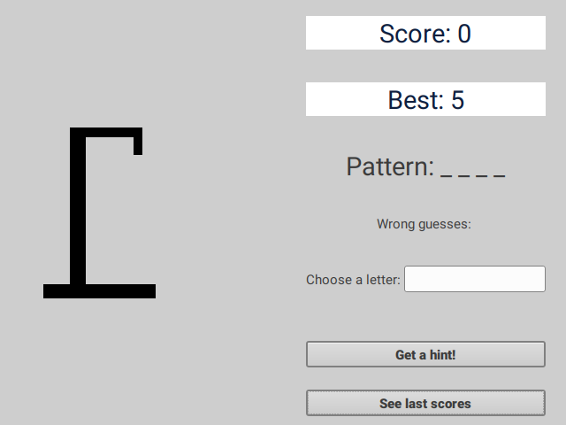
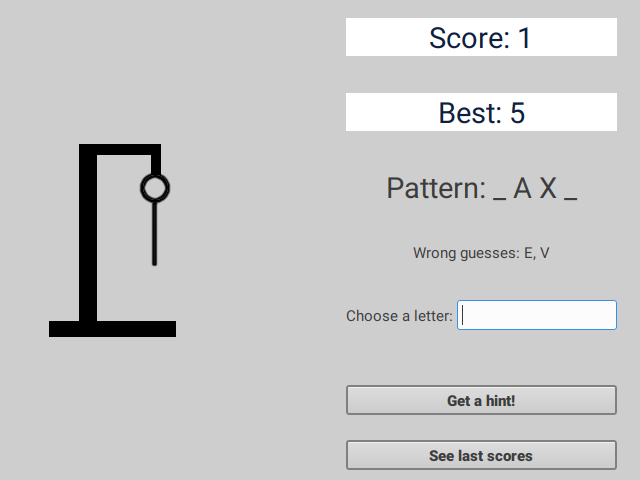
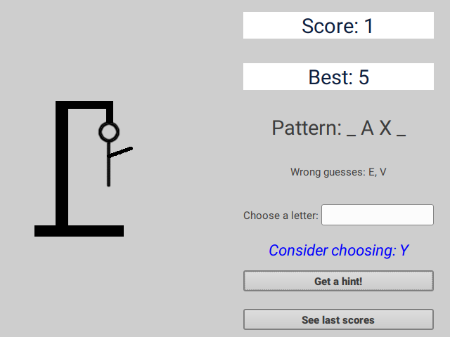
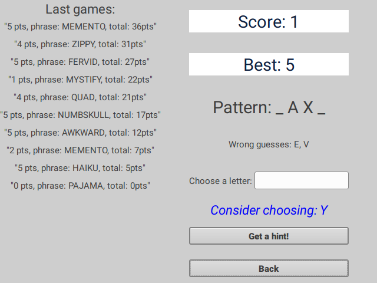
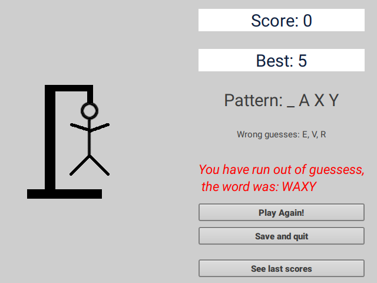

# hangman-declarative

## What is it?

Goal of this project was to write a hangman game with a graphical user inteface.

We used [gi-gtk-declarative](https://github.com/owickstrom/gi-gtk-declarative) -- a declarative programming model for GTK+ user interfaces, implementing support for various widgets and generalized patching. It's relatively new package being under active development. It allows to construct GTK gui's in a purely functional fashion.

## Declarative style

There are two main styles of writing functional programs, which are both supported by Haskell mainly because several language designers preferred these different styles.

* In the _declaration_ style you formulate an algorithm in terms of several equations that shall be satisfied.
* In the _expression_ style you compose big expressions from small expressions.

In this project instead of imperatively building up stateful objects in IO, we construct a regular data structure describing the user interface to render.

## Requirements
Project uses [Haskell Tool Stack](https://haskellstack.org/) -- a cross-platform program for developing Haskell projects.


Make sure that you have installed the necessary development packages. The following are examples for some common distributions.

### Fedora
```
sudo dnf install gobject-introspection-devel\
webkitgtk4-devel gtksourceview3-devel
```

### Debian / Ubuntu
```
sudo apt-get install libgirepository1.0-dev\
libwebkit2gtk-4.0-dev libgtksourceview-3.0-dev
```
**warning**: Stack package available in Ubuntu/Debian repositories is depreciated; using it to build the project leads to 
some [issues](https://github.com/commercialhaskell/stack/issues/4077).

In case of any problems, try

```
sudo apt purge haskell-stack
curl -sSL https://get.haskellstack.org/ | sh
```

If that doesn't help, run

```
sudo apt install cabal-install
cabal update
cabal install stack
```

### Arch Linux
```
sudo pacman -S gobject-introspection\
gobject-introspection-runtime gtksourceview3 webkit2gtk
```

## How to run
In terminal


```
cd hangman-declarative
stack build
stack exec hangman-declarative-exe
```

It takes some time for stack to build project for the first time.

### Screenshots










